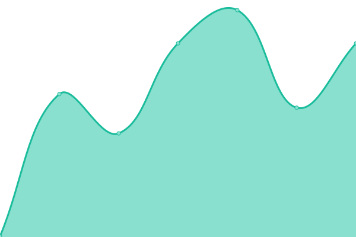
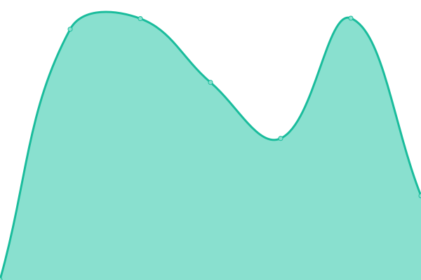

<!--start: status pages-->
<!-- This summary is generated by Upptime (https://github.com/upptime/upptime) -->
<!-- Do not edit this manually, your changes will be overwritten -->
<!-- prettier-ignore -->
| URL | Status | History | Response Time | Uptime |
| --- | ------ | ------- | ------------- | ------ |
|  [ScratchDB by DatOneLefty](https://scratchdb.lefty.one) | 🟩 Up | [scratch-db-by-dat-one-lefty.yml](https://github.com/scratchsuite/scratchrs/commits/HEAD/history/scratch-db-by-dat-one-lefty.yml) | 

 397ms
     
 | 

<a href="https://scratchsuite.github.io/scratchrs/history/scratch-db-by-dat-one-lefty">100.00%</a>
    

|  [ScratchIndexer by DatOneLefty](https://indexer.lefty.one) | 🟩 Up | [scratch-indexer-by-dat-one-lefty.yml](https://github.com/scratchsuite/scratchrs/commits/HEAD/history/scratch-indexer-by-dat-one-lefty.yml) | 

 994ms
     
 | 

<a href="https://scratchsuite.github.io/scratchrs/history/scratch-indexer-by-dat-one-lefty">100.00%</a>
    

|  [my-ocular by Jeffalo](https://my-ocular.jeffalo.net) | 🟩 Up | [my-ocular-by-jeffalo.yml](https://github.com/scratchsuite/scratchrs/commits/HEAD/history/my-ocular-by-jeffalo.yml) | 

 1040ms
     
 | 

<a href="https://scratchsuite.github.io/scratchrs/history/my-ocular-by-jeffalo">100.00%</a>
    

|  [FluffyScratch by herohamp](https://fluffyscratch.hampton.pw) | 🟥 Down | [fluffy-scratch-by-herohamp.yml](https://github.com/scratchsuite/scratchrs/commits/HEAD/history/fluffy-scratch-by-herohamp.yml) | 

 557ms
     
 | 

<a href="https://scratchsuite.github.io/scratchrs/history/fluffy-scratch-by-herohamp">100.00%</a>
    

<!--end: status pages-->

[**Visit our status website →**](https://scratchsuite.github.io/scratchrs)

## 📄 License

- Powered by: [Upptime](https://github.com/upptime/upptime)
- Code: [MIT](./LICENSE) © [9gr](scratch.mit.edu/users/9gr)
- Data in the `./history` directory: [Open Database License](https://opendatacommons.org/licenses/odbl/1-0/)
